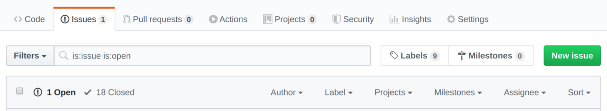
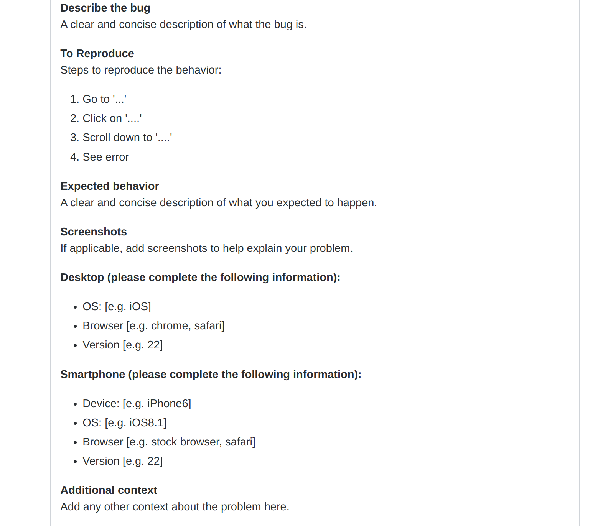

As a developer, it is common to leverage open source projects to complete your application, and it is more common to find your requirement unsatisfied or a bug stopping from fulfilling your goal.

Here are 3 tips for you to quickly fix problems in open source, it might be intuitive, but useful if you haven’t tried before.

## Check Documents

Many open source projects comes with Wiki, an official website or a `doc/` or `docs/` folder inside the repository. These locations are the first place you should look for clues to fix the problem you faced, most open source maintainers tried to keep these documents update-to-date to make sure newcomers can find what they need without too much trouble.

## Search Issues

Most of the time, you may not be the first one to face the issue if the use case you have is common, so don’t forget to search the issues inside Github or similar platform. And not just search open issues (default option in Github), but remember to check closed issues. It is a quick way to find some hotfix or even work around when your issues is not fixed by the maintainer so far.

## Open New Issues

Open new issues is the last thing you can do, but most of us may have experience that there is no response for days and feel like our issues are ignored by maintainers. It is kind of normal, but a little change can make the story different.

You have to know that maintainers are human like you and me, so they are unable to fix your issues if the information is not sufficient. I have been maintainers for open source projects for few years and there are more than 50% of the issues are poorly described and thus I was unable to fix without asking few more questions and it really takes lots of time for both sides to wait for replies from each other.

To quickly fix the problem, you have to open a good quality issue to enable the maintainers to understand your situation without too much effort. A good issues should include information like:

1. The scenario you want to achieve
1. The problem you faced (incl. error messages)
1. The code to reproduce the issue (IMPORTANT!)
1. Environment (incl. OS, the version you used)

With enough information, the maintainers can start to find and fix the bugs without wasting time guessing your situation. Although it takes more effort from you, but it really saves lots of time comparing to leave insufficient information for the maintainers to figure out. I think it is a concept of “Help you to help me” and I recommend you to try to open a good quality issue and you will find your issue will be accepted and fix soon.

## One more thing

If you still cannot get your problems fixed, don’t forget it is open source and you can always dive into the source code and find the solution all by yourself. It will take much more time, but you will learn a lot during the process, and don’t forget to create a PR if you have a good fix that can benefit others.

Although these 3 things looks fundamental to do, but sometimes the basic way is the best, hope you find it useful next time you have a problem with an open source project.
