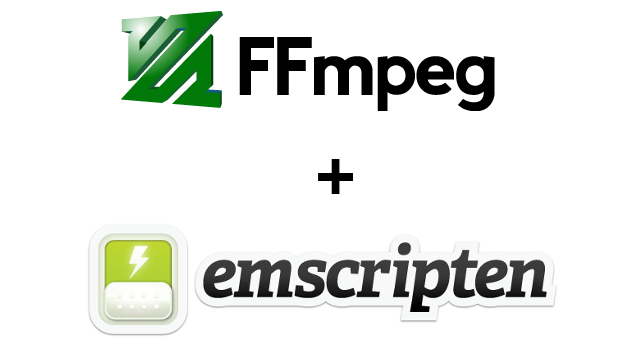

In this part you will learn:
1. The background of this series
1. How to build native FFmpeg with Docker (and without docker in MacOS)

---

## The background of this series
This series of stories aim to serve following purposes:
1. A guide for people who want to learn how to use Emscripten to compile a C/C++ library to JavaScript (Hopefully the most useful and detailed so far)
1. Personal notes

## Why FFmpeg?
FFmpeg is a free and open-source project consisting of a vast software suite of libraries and programs for handling video, audio, and other multimedia files and streams. (from Wikipedia)

It is an useful library and there is no JavaScript library with exactly the same capabilities. If you google “ffmpeg.js”, you will find few existing libraries exactly the same as what we are going to build:
- ffmpeg.js: https://github.com/Kagami/ffmpeg.js
- videoconverter.js: https://github.com/bgrins/videoconverter.js

These libraries are great and ready-to-use in most cases, but they are suffering from following issues:

- The versions of both FFmpeg and Emscripten are out-dated.
- Not under active maintenance for years. (Kagami/ffmpeg.js continues its development in April 2020)

I considered to take over maybe one of the repositories, but as there are too many changes these years, I decided to do it from scratch and wrote this series of tutorial at the same time to help people to learn how to use Emscripten in a real world C/C++ library.

## How to build native FFmpeg with Docker
To start with, we need to clone FFmpeg source code from its repository, as the master branch is under development, it is better we choose a specific release to compile.

At the moment I wrote the story, the latest stable version of FFmpeg is n4.3.1, so we will use this version through out the stories.

```bash
# Use depth=1 to download only the latest version
git clone --depth 1 --branch n4.3.1 https://github.com/FFmpeg/FFmpeg
```

After completing cloning the repository, it is time to build with GCC to make sure it works.

Actually you can skip this part if you are in a rush, but in my own experience it is better to get used to the build system of library first.

The instruction of building and installing FFmpeg can be found inside [INSTALL.md](https://github.com/FFmpeg/FFmpeg/blob/n4.3.1/INSTALL.md) in the root of the repository:

```
Installing FFmpeg:
1. Type `./configure` to create the configuration. A list of configure options is printed by running `configure -help`.
`configure` can be launched from a directory different from the FFmpeg sources to build the objects out of tree. To do this, use an absolute path when launching `configure`, e.g. `/ffmpegdir/ffmpeg/configure`.
2. Then type `make` to build FFmpeg. GNU Make 3.81 or later is required.
3. Type `make install` to install all binaries and libraries you built.
NOTICE
 - - -
- Non system dependencies (e.g. libx264, libvpx) are disabled by default.
```

As we don’t need to actually install the FFmpeg, only step 1 and 2 are required.

There are two ways to build, one is native way which requires you to install packages (ex. emsdk, Node.js). Most of time it works, but sometimes you may face bugs that is hard to resolve due to the variation of package versions and operating system. Another way is to use Docker, which provides a stable and static build environments. It is highly recommended to use Docker as it saves your time to install (and remove) the packages.

I will not cover how to install the packages here, but as I split the scripts into `build.sh` and `build-with-docker.sh` , you can install all the packages yourself and run `build.sh`.

> To make sure this tutorial can achieve maximum coverage of environments, I use Github Actions to test if it works on Linux and MacOS. For Linux users, I will use Docker way / `build-with-docker.sh` to build. For MacOS users, as Docker is not supported in Github Actions, I will use native way / `build.sh` to build.

Now, let’s create a file called `build.sh` with following content.

```bash
#!/bin/bash -x
# gcc 8 is used in this tutorial, other versions may fail
./configure --disable-x86asm
make -j
```

To build in native way, you can simply run command:

```bash
$ bash build.sh
```

To build with Docker, create a file called `build-with-docker.sh` with following content:

```bash
#!/bin/bash -x
docker pull gcc:8
docker run \
  -v $PWD:/usr/src \
  gcc:8 \
  sh -c 'cd /usr/src && bash build.sh'
```

And run command:

```bash
$ bash build-with-docker.sh
```

> `--disable-x86asm` is required to disable x86 assemble features as we are not going to use it.
Depend on the speed of you Internet and the hardware specification of your computer, it may take 10~30 minutes to complete the compilation.
And it is normal that you see tons of warnings during compilation as gcc 9 introduces more constrains.

It should take some time to compile the native FFmpeg. If everything is OK, you should be able to run `ffmpeg` with following command:

```bash
$ ./ffmpeg
```

You should see something like:

```
ffmpeg version n4.3.1 Copyright © 2000–2019 the FFmpeg developers
built with gcc 8 (GCC)
configuration: — disable-x86asm
libavutil 56. 22.100 / 56. 22.100
libavcodec 58. 35.100 / 58. 35.100
libavformat 58. 20.100 / 58. 20.100
libavdevice 58. 5.100 / 58. 5.100
libavfilter 7. 40.101 / 7. 40.101
libswscale 5. 3.100 / 5. 3.100
libswresample 3. 3.100 / 3. 3.100
Hyper fast Audio and Video encoder
usage: ffmpeg [options] [[infile options] -i infile]… {[outfile options] outfile}…
Use -h to get full help or, even better, run ‘man ffmpeg’
```

You can visit the repository here to see how it works in details: https://github.com/ffmpegwasm/FFmpeg/tree/n4.3.1-p1

And feel free to download the build artifacts here: https://github.com/ffmpegwasm/FFmpeg/releases/tag/n4.3.1-p1

---

Now we have completed the preparation, let’s move on to next post to start compiling FFmpeg with Emscripten. 😃
