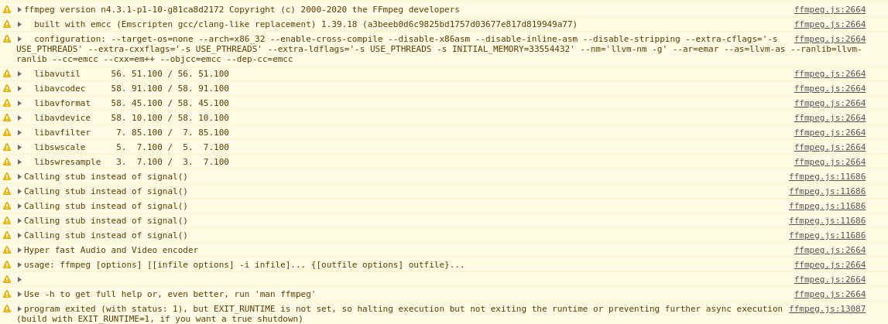

> From here, things are going to be more complicated and hard to understand, you may need to google background knowledge if you don’t know what happened (or you can leave responses to ask me).
Also, to make this tutorial more usable, I try to write down the details of how I solved each issue, hope it will help you in building the library of your choice.

In this part you will learn:
1. How to setup environment of Emscripten using Docker
1. Usage of emconfigure and emmake
1. How to fix issues when compiling FFmpeg with Emscripten

---

How to setup environment of Emscripten using Docker
In Build FFmpeg WebAssembly version (= ffmpeg.wasm): Part.1 Preparation, we have built the original version of FFmpeg with GCC, and now we move on to use Emscripten instead.

The version of Emscripten we are going to use is 1.39.18 (trzeci/emscripten:1.39.18-upstream), you can install the Emscripten through the official tutorial (in this tutorial, we are setup-emsdk Github Actions in MacOS) or pull Emscripten image from docker hub.

```bash
$ docker pull trzeci/emscripten:1.39.18-upstream
```

> It may take few minutes as the size of the image is around 1 GB.

Then we need to update `build-with-docker.sh` like below:

```bash
#!/bin/bash -x

EM_VERSION=1.39.18-upstream

docker pull trzeci/emscripten:$EM_VERSION
docker run \
  -v $PWD:/src \
  -v $PWD/cache-wasm:/emsdk_portable/.data/cache/wasm \
  trzeci/emscripten:$EM_VERSION \
  sh -c 'bash ./build.sh'
```

> cache-wasm is not required, but it can help you to speed up in subsequent build.

The next we are going to do is to find the configuration to build FFmpeg with emscripten, it is a try-and-error process and requires document digging and patient.

## Usage of `emconfigure` and `emmake` & How to fix issues when compiling FFmpeg with Emscripten
Let’s start our journey of finding the right configuration. In Part.1, it starts with `./configure --disable-x86asm`, to do it with emscripten, you need to change it to `emconfigure ./configure --disable-x86asm`. (For details of emconfigure, please check [HERE](https://emscripten.org/docs/compiling/Building-Projects.html#integrating-with-a-build-system)) And as we are doing cross compiling, we need to add cross-compiling flags to explicitly tell FFmpeg.

Let’s update `build.sh` like below:

```bash
#!/bin/bash -x

# verify Emscripten version
emcc -v

# configure FFMpeg with Emscripten
ARGS=(
  --target-os=none        # use none to prevent any os specific configurations
  --arch=x86_32           # use x86_32 to achieve minimal architectural optimization
  --enable-cross-compile  # enable cross compile
  --disable-x86asm        # disable x86 asm
)
emconfigure ./configure "${ARGS[@]}"
```

And magically there is no error or anything wrong, so do we just need to type `emmake make -j` and we get FFmpeg.wasm? Unfortunately, the answer is no. One of the most important task for `emconfigure` is to replace the compiler from gcc to emcc (or g++ to em++), but in the output of `./configure`, we still get gcc as our compiler.

```
emscripten sdl2-config called with /emsdk_portable/emscripten/tag-1.38.45/system/bin/sdl2-config --cflags                            
emscripten sdl2-config called with /emsdk_portable/emscripten/tag-1.38.45/system/bin/sdl2-config --libs                               
install prefix            /usr/local                                                                                                   
source path               .                                                                                                                
C compiler                gcc             # Should be emcc                                                                                             
C library                 glibc                                                                                                           
ARCH                      x86 (generic)                                                                                                     
big-endian                no                                                                                                            
runtime cpu detection     yes                                                                                                         
standalone assembly       no                                                                                                            
x86 assembler             nasm
```

Every automation tool has its limitation and we need to do it manually in this case. Let’s check if there is any arguments to save us.

```bash
$ ./configure --help
```

Under `Toolchain options`, there are arguments to assign the compiler to use.

```
root@57ab95def750:/src# ./configure --help
Usage: configure [options]
Options: [defaults in brackets after descriptions]
Help options:
...
Toolchain options:                                                                                                             
...
  --nm=NM                  use nm tool NM [nm -g]
  --ar=AR                  use archive tool AR [ar]
  --as=AS                  use assembler AS []
  --ln_s=LN_S              use symbolic link tool LN_S [ln -s -f]
  --strip=STRIP            use strip tool STRIP [strip]
  --windres=WINDRES        use windows resource compiler WINDRES [windres]
  --x86asmexe=EXE          use nasm-compatible assembler EXE [nasm]
  --cc=CC                  use C compiler CC [gcc]
  --cxx=CXX                use C compiler CXX [g++]
  --objcc=OCC              use ObjC compiler OCC [gcc]
  --dep-cc=DEPCC           use dependency generator DEPCC [gcc]
  --nvcc=NVCC              use Nvidia CUDA compiler NVCC [nvcc]
  --ld=LD                  use linker LD []
…..
```

Let’s pass these arguments to compile with emscripten in `build.sh` :

```bash
#!/bin/bash -x

# verify Emscripten version
emcc -v

# configure FFMpeg with Emscripten
FLAGS=(
  --target-os=none        # use none to prevent any os specific configurations
  --arch=x86_32           # use x86_32 to achieve minimal architectural optimization
  --enable-cross-compile  # enable cross compile
  --disable-x86asm        # disable x86 asm
  --nm="llvm-nm -g"
  --ar=emar
  --as=llvm-as
  --ranlib=llvm-ranlib
  --cc=emcc
  --cxx=em++
  --objcc=emcc
  --dep-cc=emcc
)
emconfigure ./configure "${FLAGS[@]}"
```

> For native build, please make sure `llvm-ranlib`, `llvm-as` and `llvm-nm` exist. If not, you can find them in `$EMSDK_ROOT/upstream/bin` .

With these arguments the `./configure` will take more time to run, but you will get desired output in the end.

```
emscripten sdl2-config called with /emsdk_portable/emscripten/tag-1.39.18/system/bin/sdl2-config --cflags                            
emscripten sdl2-config called with /emsdk_portable/emscripten/tag-1.39.18/system/bin/sdl2-config --libs                                     
install prefix            /usr/local                                                                                                   
source path               .                                                                                                         
C compiler                emcc         # emcc as expected                                                                                    
C library                                                                                                                          
ARCH                      x86 (generic)                                                                                                     
big-endian                no                                                                                                              
runtime cpu detection     yes                                                                                                             
standalone assembly       no
```

Add `emmake make -j4` (You can raise the parallelism to like `-j8` or simply use `-j` to use all cores) in the end of `build.sh` :

```bash
#!/bin/bash -x

# verify Emscripten version
emcc -v

# configure FFMpeg with Emscripten
ARGS=(
  --target-os=none        # use none to prevent any os specific configurations
  --arch=x86_32           # use x86_32 to achieve minimal architectural optimization
  --enable-cross-compile  # enable cross compile
  --disable-x86asm        # disable x86 asm
  --nm="llvm-nm -g"
  --ar=emar
  --as=llvm-as
  --ranlib=llvm-ranlib
  --cc=emcc
  --cxx=em++
  --objcc=emcc
  --dep-cc=emcc
)
emconfigure ./configure "${ARGS[@]}"

# build ffmpeg.wasm
emmake make -j4
```

And it fails immediately after execution:

```
...
./libavutil/x86/timer.h:39:24: error: invalid output constraint '=a' in asm
                     : "=a" (a), "=d" (d));
                       ^
```
From the output message, we can identify that the error is related to asm. Open `./libavutil/x86/timer.h` and we can confirm the issue is caused by the x86 inline assembly, which is not compatible with WebAssembly, so the solution is to disable it in `build.sh`:

```bash
#!/bin/bash -x

# verify Emscripten version
emcc -v

# configure FFMpeg with Emscripten
ARGS=(
  --target-os=none        # use none to prevent any os specific configurations
  --arch=x86_32           # use x86_32 to achieve minimal architectural optimization
  --enable-cross-compile  # enable cross compile
  --disable-x86asm        # disable x86 asm
  --disable-inline-asm    # disable inline asm
  --nm="llvm-nm -g"
  --ar=emar
  --as=llvm-as
  --ranlib=llvm-ranlib
  --cc=emcc
  --cxx=em++
  --objcc=emcc
  --dep-cc=emcc
)
emconfigure ./configure "${ARGS[@]}"

# build ffmpeg.wasm
emmake make -j4
```

It works and keeps compiling until we hit another error:

```
...
CC libavfilter/dnn/dnn_backend_native_layers.o
In file included from libavfilter/aeval.c:26:
In file included from ./libavutil/avassert.h:31:
In file included from ./libavutil/avutil.h:296:
In file included from ./libavutil/common.h:533:
In file included from ./libavutil/internal.h:176:
./libavutil/libm.h:54:32: error: static declaration of 'cbrt' follows non-static declaration
static av_always_inline double cbrt(double x)
                               ^
/emsdk_portable/upstream/emscripten/system/include/libc/math.h:151:13: note: previous declaration is here
double      cbrt(double);
            ^
In file included from libavfilter/aeval.c:26:
```

This time the root cause is not so obvious, so we need to dig deeper inside what went wrong during the `./configure`. A very helpful file to check is `ffbuild/config.log`, it contains logs during `./configure` and most of time you can find the root cause there.

By search `cbrt` inside `config.log`, we find error message below:

```
...
check_mathfunc cbrt 1                                                         
test_ld cc                                                                     
test_cc                                                                       
BEGIN /tmp/ffconf.syfN4Irw/test.c                                             
1 #include <math.h>                                                           
2 float foo(float f, float g) { return cbrt(f); }         
    3 int main(void){ return (int) foo; }                                     
END /tmp/ffconf.syfN4Irw/test.c                                               
emcc -D_ISOC99_SOURCE -D_FILE_OFFSET_BITS=64 -D_LARGEFILE_SOURCE -D_POSIX_C_SOURCE=200112 -D_XOPEN_SOURCE=600 -std=c11 -fomit-frame-pointer -pthread -c -o /tmp/ffconf.syfN4Irw/test.o /tmp/ffconf.syfN4Irw/test.c         
emcc -Wl,-z,noexecstack -o /tmp/ffconf.syfN4Irw/test /tmp/ffconf.syfN4Irw/test.o
wasm-ld: error: 'atomics' feature is used by /tmp/ffconf.syfN4Irw/test.o, so --shared-memory must be used
...                    
```

This test tried to check if cbrt works in the environment, but it fails due to `atomics` feature errored. `atomics` is asked when you are using pthread, so let’s add `pthread` flags. (Check [HERE](https://emscripten.org/docs/porting/pthreads.html) for more details about pthread flags)

Update `build.sh`:

```bash
#!/bin/bash -x

# verify Emscripten version
emcc -v

# configure FFMpeg with Emscripten
CFLAGS="-s USE_PTHREADS"
LDFLAGS="$CFLAGS"
ARGS=(
  --target-os=none        # use none to prevent any os specific configurations
  --arch=x86_32           # use x86_32 to achieve minimal architectural optimization
  --enable-cross-compile  # enable cross compile
  --disable-x86asm        # disable x86 asm
  --disable-inline-asm    # disable inline asm
  --extra-cflags="$CFLAGS"
  --extra-cxxflags="$CFLAGS"
  --extra-ldflags="$LDFLAGS"
  --nm="llvm-nm -g"
  --ar=emar
  --as=llvm-as
  --ranlib=llvm-ranlib
  --cc=emcc
  --cxx=em++
  --objcc=emcc
  --dep-cc=emcc
)
emconfigure ./configure "${ARGS[@]}"

# build ffmpeg.wasm
emmake make -j4
```

It works and keeps compiling until we hit another error:

```
...
LD      ffplay_g                                                                                                                                  emcc: warning: ignoring unsupported linker flag: `-rpath-link=:libpostproc:libswresample:libswscale:libavfilter:libavdevice:libavformat:libavcodec:libavutil:libavresample` [-Wlinkflags]                                                                                                           
7 warnings generated.                                                      
wasm-ld: error: initial memory too small, 19491744 bytes needed
...                    
make: *** [Makefile:114: ffplay_g] Error 1
make: *** Waiting for unfinished jobs....
emcc: warning: ignoring unsupported linker flag: `-rpath-link=:libpostproc:libswresample:libswscale:libavfilter:libavdevice:libavformat:libavcodec
:libavutil:libavresample` [-Wlinkflags]
...
```

This time the issue is caused by too small in initial memory (by default only 16 MB in Emscripten, and here the minimal is 19+ MB), so we need to raise the initial memory to a higher value by passing `-s INITIAL_MEMORY=33554432` (32 MB).

```bash
#!/bin/bash -x

# verify Emscripten version
emcc -v

# configure FFMpeg with Emscripten
CFLAGS="-s USE_PTHREADS"
LDFLAGS="$CFLAGS -s INITIAL_MEMORY=33554432" # 33554432 bytes = 32 MB
ARGS=(
  --target-os=none        # use none to prevent any os specific configurations
  --arch=x86_32           # use x86_32 to achieve minimal architectural optimization
  --enable-cross-compile  # enable cross compile
  --disable-x86asm        # disable x86 asm
  --disable-inline-asm    # disable inline asm
  --extra-cflags="$CFLAGS"
  --extra-cxxflags="$CFLAGS"
  --extra-ldflags="$LDFLAGS"
  --nm="llvm-nm -g"
  --ar=emar
  --as=llvm-as
  --ranlib=llvm-ranlib
  --cc=emcc
  --cxx=em++
  --objcc=emcc
  --dep-cc=emcc
)

emconfigure ./configure "${ARGS[@]}"

# build ffmpeg.wasm
emmake make -j4
```

Still there is an error after this fix:

```
LD      ffplay_g
emcc: warning: ignoring unsupported linker flag: `-rpath-link=:libpostproc:libswresample:libswscale:libavfilter:libavdevice:libavformat:libavcodec:libavutil:libavresample` [-Wlinkflags]
6 warnings generated.
LD      ffmpeg_g
emcc: warning: ignoring unsupported linker flag: `-rpath-link=:libpostproc:libswresample:libswscale:libavfilter:libavdevice:libavformat:libavcodec:libavutil:libavresample` [-Wlinkflags]
9 warnings generated.
LD      ffprobe_g
emcc: warning: ignoring unsupported linker flag: `-rpath-link=:libpostproc:libswresample:libswscale:libavfilter:libavdevice:libavformat:libavcodec:libavutil:libavresample` [-Wlinkflags]
STRIP   ffmpeg
strip:ffmpeg_g: file format not recognized
make: *** [Makefile:107: ffmpeg] Error 1
make: *** Waiting for unfinished jobs....
```

As we are unable to strip (make sense as it is not in a valid binary format), let’s simply disable strip with `--disable-stripping` and make again:

```bash
#!/bin/bash -x

# verify Emscripten version
emcc -v

# configure FFMpeg with Emscripten
CFLAGS="-s USE_PTHREADS"
LDFLAGS="$CFLAGS -s INITIAL_MEMORY=33554432" # 33554432 bytes = 32 MB
ARGS=(
  --target-os=none        # use none to prevent any os specific configurations
  --arch=x86_32           # use x86_32 to achieve minimal architectural optimization
  --enable-cross-compile  # enable cross compile
  --disable-x86asm        # disable x86 asm
  --disable-inline-asm    # disable inline asm
  --disable-stripping     # disable stripping
  --extra-cflags="$CFLAGS"
  --extra-cxxflags="$CFLAGS"
  --extra-ldflags="$LDFLAGS"
  --nm="llvm-nm -g"
  --ar=emar
  --as=llvm-as
  --ranlib=llvm-ranlib
  --cc=emcc
  --cxx=em++
  --objcc=emcc
  --dep-cc=emcc
)

emconfigure ./configure "${ARGS[@]}"

# build ffmpeg.wasm
emmake make -j4
```

Finally we managed to successfully do the `emmake make -j` part and you can see ffplay / ffplay\_g, ffprobe / ffprobe\_g and ffmpeg / ffmpeg\_g generated in the root folder. It looks perfect, but there is a weird \_g suffix makes the output files like this:
- ffmpeg
- ffmpeg_g
- ffmpeg_g.wasm
- ffmpeg_g.worker.js

Both ffmpeg and ffmpeg_g here are actualy js files, the ideal naming is like below:
- ffmpeg / ffmpeg_g => ffmpeg.js
- ffmpeg_g.wasm => ffmpeg.wasm
- ffmpeg_g.worker.js => ffmpeg.worker.js

To fix this issue, we need to build it by our own. The command to build ffmpeg can be extracted by running `emmake make -n`:

```
...
printf "LD\t%s\n" ffmpeg_g; emcc -Llibavcodec -Llibavdevice -Llibavfilter -Llibavformat -Llibavresample -Llibavutil -Llibpostproc -Llibswscale -Llibswresample -Wl,--as-needed -Wl,-z,noexecstack -Wl,--warn-common -Wl,-rpath-link=libpostproc:libswresample:libswscale:libavfilter:libavdevice:libavformat:libavcodec:libavutil:libavresample -Qunused-arguments   -o ffmpeg_g fftools/ffmpeg_opt.o fftools/ffmpeg_filter.o fftools/ffmpeg_hw.o fftools/cmdutils.o fftools/ffmpeg.o  -lavdevice -lavfilter -lavformat -lavcodec -lswresample -lswscale -lavutil  -lm -pthread -lm -lm -pthread -lm -lm -lm -pthread -lm
printf "CP\t%s\n" ffmpeg; cp -p ffmpeg_g ffmpeg
…..
```

With a little clean up:

```
emcc \
  -I. -I./fftools \
  -Llibavcodec -Llibavdevice -Llibavfilter -Llibavformat -Llibavresample -Llibavutil -Llibpostproc -Llibswscale -Llibswresample \
  -Qunused-arguments \
  -o ffmpeg_g fftools/ffmpeg_opt.o fftools/ffmpeg_filter.o fftools/ffmpeg_hw.o fftools/cmdutils.o fftools/ffmpeg.o \
  -lavdevice -lavfilter -lavformat -lavcodec -lswresample -lswscale -lavutil -lm
```

As we are building our own version, let’s add `--disable-programs` and `--disable-doc` in `./configure` step to speed up the build and also add some essential flags when build ffmpeg

```bash
#!/bin/bash -x

# verify Emscripten version
emcc -v

# configure FFMpeg with Emscripten
CFLAGS="-s USE_PTHREADS"
LDFLAGS="$CFLAGS -s INITIAL_MEMORY=33554432" # 33554432 bytes = 32 MB
CONFIG_ARGS=(
  --target-os=none        # use none to prevent any os specific configurations
  --arch=x86_32           # use x86_32 to achieve minimal architectural optimization
  --enable-cross-compile  # enable cross compile
  --disable-x86asm        # disable x86 asm
  --disable-inline-asm    # disable inline asm
  --disable-stripping     # disable stripping
  --disable-programs      # disable programs build (incl. ffplay, ffprobe & ffmpeg)
  --disable-doc           # disable doc
  --extra-cflags="$CFLAGS"
  --extra-cxxflags="$CFLAGS"
  --extra-ldflags="$LDFLAGS"
  --nm="llvm-nm -g"
  --ar=emar
  --as=llvm-as
  --ranlib=llvm-ranlib
  --cc=emcc
  --cxx=em++
  --objcc=emcc
  --dep-cc=emcc
)
emconfigure ./configure "${CONFIG_ARGS[@]}"

# build dependencies
emmake make -j4

# build ffmpeg.wasm
mkdir -p wasm/dist
ARGS=(
  -I. -I./fftools
  -Llibavcodec -Llibavdevice -Llibavfilter -Llibavformat -Llibavresample -Llibavutil -Llibpostproc -Llibswscale -Llibswresample
  -Qunused-arguments
  -o wasm/dist/ffmpeg.js fftools/ffmpeg_opt.c fftools/ffmpeg_filter.c fftools/ffmpeg_hw.c fftools/cmdutils.c fftools/ffmpeg.c
  -lavdevice -lavfilter -lavformat -lavcodec -lswresample -lswscale -lavutil -lm
  -s USE_SDL=2                    # use SDL2
  -s USE_PTHREADS=1               # enable pthreads support
  -s INITIAL_MEMORY=33554432      # 33554432 bytes = 32 MB
)
emcc "${ARGS[@]}"
```

Let’s create a [basic.html](https://github.com/ffmpegwasm/FFmpeg/blob/n4.3.1-p2/wasm/basic.html) to test if ffmpeg.wasm is working:

```html
<!DOCTYPE html>
<html lang="en">
<head>
  <meta charset="UTF-8">
  <title></title>
  <script src="./dist/ffmpeg.js"></script>
</head>
<body>
</body>
</html>
```

Run a lightweight web server (ex. `python3 -m http.server 3000`) and visit the web page (ex. http://localhost:3000/basic.html) and open the Chrome DevTools.



It is kind of working as you can see output similar to original FFmpeg, it gives us a good starting point to polish our ffmpeg.wasm library.

You can visit the repository here to see how it works in details: https://github.com/ffmpegwasm/FFmpeg/tree/n4.3.1-p2

And feel free to download the build artifacts here: https://github.com/ffmpegwasm/FFmpeg/releases/tag/n4.3.1-p2

---

For how to polish and create a “real” ffmpeg.wasm library, please see next post in this series of stories. 😃
