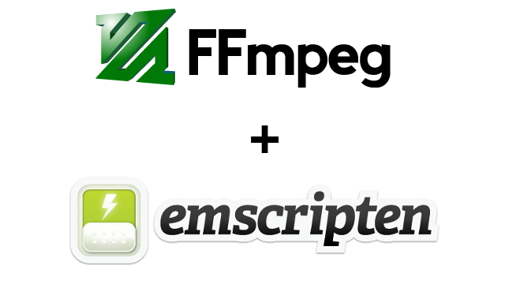

In this part you will learn:
1. Build a library version of FFmpeg with optimized arguments.
1. Interact with ffmpeg.wasm
1. Manage Emscripten File System.
1. Develop ffmpeg.wasm v0.1 with transcoding feature.

---

## Build a library version of FFmpeg with optimized arguments.
In Part.3, our goal is to create a basic ffmpeg.wasm v0.1 to transcode avi to mp4. As we only create a basic version of FFmpeg in Part.2, now we need to further optimized with few arguments.
1. `-O3` : optimize code and reduce code size (from 30 MB to 15 MB) (More details [HERE](https://emscripten.org/docs/optimizing/Optimizing-Code.html))
1. `-s PROXY_TO_PTHREAD=1` : to make our program for responsive when using pthread (More details [HERE](https://emscripten.org/docs/porting/pthreads.html#additional-flags))
1. `-o wasm/dist/ffmpeg-core.js` : rename ffmpeg.js to ffmpeg-core.js
(From here we call it ffmpeg-core.js as we will create a ffmpeg.js library to wrap the ffmpeg-core.js and provide user friendly APIs.)
1. `-s EXPORTED_FUNCTIONS="[_main, _proxy_main]"` : export main() and proxy_main() (added by PROXY_TO_PTHREAD) C function to JavaScript world
1. `-s EXTRA_EXPORTED_RUNTIME_METHODS="[FS, cwrap, setValue, writeAsciiToMemory]"` : extra functions for manipulating functions, file system and pointers, check Interacting with code and preamble.js for more details.

> For more details about these arguments, you can check src/settings.js in emscripten github repository.

With all the new arguments, let’s update our `build.sh` :

```bash
#!/bin/bash -x

# verify Emscripten version
emcc -v

# configure FFMpeg with Emscripten
CFLAGS="-s USE_PTHREADS -O3"
LDFLAGS="$CFLAGS -s INITIAL_MEMORY=33554432" # 33554432 bytes = 32 MB
CONFIG_ARGS=(
  --target-os=none        # use none to prevent any os specific configurations
  --arch=x86_32           # use x86_32 to achieve minimal architectural optimization
  --enable-cross-compile  # enable cross compile
  --disable-x86asm        # disable x86 asm
  --disable-inline-asm    # disable inline asm
  --disable-stripping     # disable stripping
  --disable-programs      # disable programs build (incl. ffplay, ffprobe & ffmpeg)
  --disable-doc           # disable doc
  --extra-cflags="$CFLAGS"
  --extra-cxxflags="$CFLAGS"
  --extra-ldflags="$LDFLAGS"
  --nm="llvm-nm -g"
  --ar=emar
  --as=llvm-as
  --ranlib=llvm-ranlib
  --cc=emcc
  --cxx=em++
  --objcc=emcc
  --dep-cc=emcc
)
emconfigure ./configure "${CONFIG_ARGS[@]}"

# build dependencies
emmake make -j4

# build ffmpeg.wasm
mkdir -p wasm/dist
ARGS=(
  -I. -I./fftools
  -Llibavcodec -Llibavdevice -Llibavfilter -Llibavformat -Llibavresample -Llibavutil -Llibpostproc -Llibswscale -Llibswresample
  -Qunused-arguments
  -o wasm/dist/ffmpeg.js fftools/ffmpeg_opt.c fftools/ffmpeg_filter.c fftools/ffmpeg_hw.c fftools/cmdutils.c fftools/ffmpeg.c
  -lavdevice -lavfilter -lavformat -lavcodec -lswresample -lswscale -lavutil -lm
  -O3                                           # Optimize code with performance first
  -s USE_SDL=2                                  # use SDL2
  -s USE_PTHREADS=1                             # enable pthreads support
  -s PROXY_TO_PTHREAD=1                         # detach main() from browser/UI main thread
  -s INVOKE_RUN=0                               # not to run the main() in the beginning
  -s EXPORTED_FUNCTIONS="[_main, _proxy_main]"  # export main and proxy_main funcs
  -s EXTRA_EXPORTED_RUNTIME_METHODS="[FS, cwrap, setValue, writeAsciiToMemory]"   # export preamble funcs
  -s INITIAL_MEMORY=33554432                    # 33554432 bytes = 32 MB
)
emcc "${ARGS[@]}"
```

Next, let’s try to interact with ffmpeg.wasm.

## Interact with ffmpeg.wasm
To make sure our ffmpeg.wasm is working, let’s try to achieve following command in ffmpeg.wasm:

```bash
$ ffmpeg -hide_banner
```

With `-hide_banner` argument, ffmpeg hides details about its version and build arguments, a typical output looks like this:

```
Hyper fast Audio and Video encoder
usage: ffmpeg [options] [[infile options] -i infile]... {[outfile options] outfile}...
Use -h to get full help or, even better, run 'man ffmpeg'
```

To begin with, let’s create a file called `ffmpeg.js` with following code:

```javascript
const Module = require('./dist/ffmpeg-core.js');

Module.onRuntimeInitialized = () => {
  const ffmpeg = Module.cwrap('proxy_main', 'number', ['number', 'number']);
};
```

The execution of the code above requires extra parameters in Node.JS:

```bash
$ node --experimental-wasm-threads --experimental-wasm-bulk-memory ffmpeg.js
```

Explanation for the functions:
- `onRuntimeInitialized` : as WebAssembly requires some time to boot up, you need to wait for this function to be called before using the library.
- `cwrap` : a wrapper function for the C function in JavaScript world. Here we wrap proxy_main() / main() function in `fftools/ffmpeg.c`. The function signature is `int main(int argc, char **argv)`, it is straightforward that `int` is mapping to `number` and as `char **argv` is a pointer in C, we can also mapping it to `number`.

Then we need to pass the arguments to it. The equivalent argument for `$ ffmpeg -hide_banner` is `main(2, ["./ffmpeg", "-hide_banner"])`. The first argument is easy, but how can we pass a string array? Let’s decompose the issue to two parts:

- We need to convert string in JavaScript to char array in C
- We need ot convert a number array in JavaScript to a pointer array in C

The 1st part is easier as we have an utility function from Emscripten called `writeAsciiToMemory()` to help us, below is an example of using this function:

```javascript
const str = "FFmpeg.wasm";
const buf = Module._malloc(str.length + 1); // Allocate a memory with extra byte with value 0 to indicate the end of the string
Module.writeAsciiToMemory(str, buf);
```

The 2nd part is tricky, we need to create a pointer array in C with 32 bit integer as the pointer is in 32 bit integer. We need to use setValue here to create the array we need:

```javascript
const ptrs = [123, 3455];
const buf = Module._malloc(ptrs.length * Uint32Array.BYTES_PER_ELEMENT);
ptrs.forEach((p, idx) => {
  Module.setValue(buf + (Uint32Array.BYTES_PER_ELEMENT * idx), p, 'i32');
});
```

Merge all the snippets above, now we can interact with ffmpeg.wasm and generate expected result:

```javascript
const Module = require('./dist/ffmpeg-core');

Module.onRuntimeInitialized = () => {
  const ffmpeg = Module.cwrap('proxy_main', 'number', ['number', 'number']);
  const args = ['ffmpeg', '-hide_banner'];
  const argsPtr = Module._malloc(args.length * Uint32Array.BYTES_PER_ELEMENT);
  args.forEach((s, idx) => {
    const buf = Module._malloc(s.length + 1);
    Module.writeAsciiToMemory(s, buf);
    Module.setValue(argsPtr + (Uint32Array.BYTES_PER_ELEMENT * idx), buf, 'i32');
  })
  ffmpeg(args.length, argsPtr);
};
```

Now, we can interact with ffmpeg.wasm with ease, but how can we pass the video file to it? That is the focus of next section: File System.

## Manage Emscripten File System.

In Emscripten, there is a virtual file system to support standard file read/write in C, thus we need to write our video file into this File System before passing the arguments to ffmpeg.wasm.

> Find more details in [File System API](https://emscripten.org/docs/api_reference/Filesystem-API.html).

Most of the time, there are only 2 FS functions you need to complete the task: `FS.writeFile()` and `FS.readFile()` .

For all the data writing to or reading from the File System, it must be in Uint8Array type in JavaScript, remember to do type conversion before consuming the data.

For this tutorial, let’s use a file called flame.avi (You can download it [HERE](https://github.com/ffmpegwasm/testdata/raw/master/flame.avi)) and read it with `fs.readFileSync()` and write it to Emscripten File System with `FS.writeFile()` .

```javascript
const fs = require('fs');
const Module = require('./dist/ffmpeg-core');

Module.onRuntimeInitialized = () => {
  const data = Uint8Array.from(fs.readFileSync('./flame.avi'));
  Module.FS.writeFile('flame.avi', data);

  const ffmpeg = Module.cwrap('proxy_main', 'number', ['number', 'number']);
  const args = ['ffmpeg', '-hide_banner'];
  const argsPtr = Module._malloc(args.length * Uint32Array.BYTES_PER_ELEMENT);
  args.forEach((s, idx) => {
    const buf = Module._malloc(s.length + 1);
    Module.writeAsciiToMemory(s, buf);
    Module.setValue(argsPtr + (Uint32Array.BYTES_PER_ELEMENT * idx), buf, 'i32');
  })
  ffmpeg(args.length, argsPtr);
};
```

## Develop ffmpeg.wasm v0.1 with transcoding feature.

Now we are able to pass arguments to ffmpeg.wasm and save files to File System, let’s compose all of them together and get our ffmpeg.wasm v0.1 working.

The last one more detail we need to be aware of is that `ffmpeg()` above is actually running asynchronously, so to get the output file we need to use a `setInterval()` to parse the log file to know if the tranding completes.

Put everything together, now we have our first ffmpeg.wasm to transcode a avi file to mp4 file with any issues:

```javascript
const fs = require('fs');
const Module = require('./dist/ffmpeg-core');

Module.onRuntimeInitialized = () => {
  const data = Uint8Array.from(fs.readFileSync('./flame.avi'));
  Module.FS.writeFile('flame.avi', data);

  const ffmpeg = Module.cwrap('proxy_main', 'number', ['number', 'number']);
  const args = ['ffmpeg', '-hide_banner', '-report', '-i', 'flame.avi', 'flame.mp4'];
  const argsPtr = Module._malloc(args.length * Uint32Array.BYTES_PER_ELEMENT);
  args.forEach((s, idx) => {
    const buf = Module._malloc(s.length + 1);
    Module.writeAsciiToMemory(s, buf);
    Module.setValue(argsPtr + (Uint32Array.BYTES_PER_ELEMENT * idx), buf, 'i32');
  });
  ffmpeg(args.length, argsPtr);

  /*
   * The execution of ffmpeg is not synchronized,
   * so we need to parse the log file to check if completed.
   */
  const timer = setInterval(() => {
    const logFileName = Module.FS.readdir('.').find(name => name.endsWith('.log'));
    if (typeof logFileName !== 'undefined') {
      const log = String.fromCharCode.apply(null, Module.FS.readFile(logFileName));
      if (log.includes("frames successfully decoded")) {
        clearInterval(timer);
        const output = Module.FS.readFile('flame.mp4');
        fs.writeFileSync('flame.mp4', output);
      }
    }
  }, 500);

};
```

You can visit the repository here to see how it works in details: https://github.com/ffmpegwasm/FFmpeg/tree/n4.3.1-p3

And feel free to download the build artifacts here: https://github.com/ffmpegwasm/FFmpeg/releases/tag/n4.3.1-p3

---

Please note currently it is a Node.js only version, but we will develop a browser version in next post.

Look forward to seeing you in Part.4. 😃
