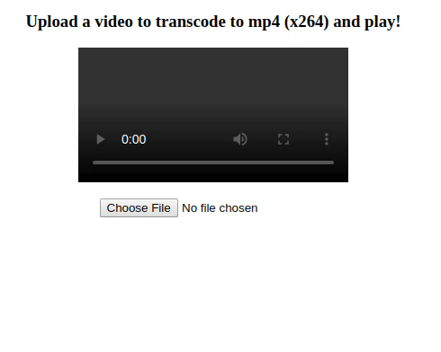

In this part you will learn:
1. Add Libx264 to ffmpeg-core.js
1. In browser ffmpeg.wasm demo

---

## Add Libx264 to ffmpeg-core.js
For next step, we would like to transcode an avi video and play it in our web browser. By default ffmpeg-core.js can transcode avi to mp4, but that mp4 file cannot be played in web browser as its encoding is not supported. So we need to add libx264 to our ffmpeg-core.js first.

Below is the link to the x264 library we are going to add:

https://code.videolan.org/videolan/x264

`x264` is much easier to build compared to ffmpeg, below are the key arguments you need to pass:

```bash
#!/bin/bash -x

ARGS=(
  --host=i686-gnu                     # use i686 gnu
  --enable-static                     # enable building static library
  --disable-cli                       # disable cli tools
  --disable-asm                       # disable asm optimization
  --extra-cflags="-s USE_PTHREADS=1"  # pass this flags for using pthreads
)
emconfigure ./configure "${ARGS[@]}"
```

> Check the repository for the full version of [build-x264.sh](https://github.com/ffmpegwasm/FFmpeg/blob/n4.3.1-p4/wasm/build-scripts/build-x264.sh)

While configuring ffmpeg, `--enable-gpl` and `--enable-libx264` flags must be added.

```bash
#!/bin/bash -x

# ...

CONFIG_ARGS=(
  --target-os=none        # use none to prevent any os specific configurations
  --arch=x86_32           # use x86_32 to achieve minimal architectural optimization
  --enable-cross-compile  # enable cross compile
  --disable-x86asm        # disable x86 asm
  --disable-inline-asm    # disable inline asm
  --disable-stripping     # disable stripping
  --disable-programs      # disable programs build (incl. ffplay, ffprobe & ffmpeg)
  --disable-doc           # disable doc
  --enable-gpl            ## required by x264
  --enable-libx264        ## enable x264
  --extra-cflags="$CFLAGS"
  --extra-cxxflags="$CFLAGS"
  --extra-ldflags="$LDFLAGS"
  --nm="llvm-nm -g"
  --ar=emar
  --as=llvm-as
  --ranlib=llvm-ranlib
  --cc=emcc
  --cxx=em++
  --objcc=emcc
  --dep-cc=emcc
)
emconfigure ./configure "${CONFIG_ARGS[@]}"

# ...

ARGS=(
  -I. -I./fftools -I$BUILD_DIR/include
  -Llibavcodec -Llibavdevice -Llibavfilter -Llibavformat -Llibavresample -Llibavutil -Llibpostproc -Llibswscale -Llibswresample -L$BUILD_DIR/lib
  -Qunused-arguments
  -o wasm/dist/ffmpeg-core.js fftools/ffmpeg_opt.c fftools/ffmpeg_filter.c fftools/ffmpeg_hw.c fftools/cmdutils.c fftools/ffmpeg.c
  # Add -lpostproc and -lx264 below
  -lavdevice -lavfilter -lavformat -lavcodec -lswresample -lswscale -lavutil -lpostproc -lm -lx264 -pthread
  -O3                                           # Optimize code with performance first
  -s USE_SDL=2                                  # use SDL2
  -s USE_PTHREADS=1                             # enable pthreads support
  -s PROXY_TO_PTHREAD=1                         # detach main() from browser/UI main thread
  -s INVOKE_RUN=0                               # not to run the main() in the beginning
  -s EXPORTED_FUNCTIONS="[_main, _proxy_main]"  # export main and proxy_main funcs
  -s EXTRA_EXPORTED_RUNTIME_METHODS="[FS, cwrap, setValue, writeAsciiToMemory]"   # export preamble funcs
  -s INITIAL_MEMORY=268435456                   ## increase to 268435456 bytes = 256 MB
)
emcc "${ARGS[@]}"
```

> Check the repository for the full version of [configure.sh](https://github.com/ffmpegwasm/FFmpeg/blob/n4.3.1-p4/wasm/build-scripts/configure.sh) and [build-ffmpeg.sh](https://github.com/ffmpegwasm/FFmpeg/blob/n4.3.1-p4/wasm/build-scripts/build-ffmpeg.sh)

With all script in place, now you can build a ffmpeg.wasm with x264 (and potentially all other libraries.)

## In browser ffmpeg.wasm demo

The final part of this story is a demo for ffmpeg.wasm v0.2, the scenario is to create a web page that enables user to upload a video file (ex. avi) and play inside the web browser. As it is not possible to play avi file directly, we will use ffmpeg.wasm to transcode the video first:



Below is the full HTML code (download sample video [HERE](https://github.com/ffmpegwasm/ffmpeg.wasm/raw/master/tests/assets/flame.avi)):

```html
<html>                                                                                                                                            
  <head>                                                                                                                                          
    <style>                                                                                                                                       
      html, body {                                                       
        margin: 0;                                                       
        width: 100%;                                                     
        height: 100%                                                     
      }                                                                  
      body {                                                                                                                                      
        display: flex;                                                   
        flex-direction: column;
        align-items: center;                                             
      }   
    </style>                                                                                                                                      
  </head>                                                                
  <body>                                                                 
    <h3>Upload a video to transcode to mp4 (x264) and play!</h3>
    <video id="output-video" controls></video><br/> 
    <input type="file" id="uploader">                   
    <p id="message">Remeber to wait for 5 seconds for ffmpeg.wasm to load</p>
    <script type="text/javascript">                                                                                                               
      const readFromBlobOrFile = (blob) => (
        new Promise((resolve, reject) => {
          const fileReader = new FileReader();
          fileReader.onload = () => {
            resolve(fileReader.result);
          };
          fileReader.onerror = ({ target: { error: { code } } }) => {
            reject(Error(`File could not be read! Code=${code}`));
          };
          fileReader.readAsArrayBuffer(blob);
        })
      );
      const message = document.getElementById('message');
      const transcode = async ({ target: { files } }) => {
        const { name } = files[0];
        message.innerHTML = 'Writing file to MEMFS';
        const data = await readFromBlobOrFile(files[0]);                                                                                          
        Module.FS.writeFile(name, new Uint8Array(data));                                                                                          
        const ffmpeg = Module.cwrap('proxy_main', 'number', ['number', 'number']);
        const args = ['ffmpeg', '-hide_banner', '-nostdin', '-report', '-i', name, 'out.mp4'];
        const argsPtr = Module._malloc(args.length * Uint32Array.BYTES_PER_ELEMENT);
        args.forEach((s, idx) => {                                       
          const buf = Module._malloc(s.length + 1);                      
          Module.writeAsciiToMemory(s, buf);                                                                                                      
          Module.setValue(argsPtr + (Uint32Array.BYTES_PER_ELEMENT * idx), buf, 'i32');
        });                    
        message.innerHTML = 'Start to transcode';                        
        ffmpeg(args.length, argsPtr);

        /*                                                               
         * The execution of ffmpeg is not synchronized,                  
         * so we need to parse the log file to check if completed.
         */                                                              
        const timer = setInterval(() => {               
          const logFileName = Module.FS.readdir('.').find(name => name.endsWith('.log'));
          if (typeof logFileName !== 'undefined') {                                                                                               
            const log = String.fromCharCode.apply(null, Module.FS.readFile(logFileName));
            if (log.includes("frames successfully decoded")) {
              clearInterval(timer);                                      
              message.innerHTML = 'Finish transcoding';
              const out = Module.FS.readFile('out.mp4');
              const video = document.getElementById('output-video');
              video.src = URL.createObjectURL(new Blob([out.buffer], { type: 'video/mp4' }));
            }                                                            
          } 
        }, 500);                                                         
      };  
      document.getElementById('uploader').addEventListener('change', transcode);
    </script>                                                            
    <script type="text/javascript" src="./dist/ffmpeg-core.js"></script>
  </body>                         
</html>
```

> It may take a long time to complete, you can open DevTools to see logs. Check [transcode.html](https://github.com/ffmpegwasm/FFmpeg/blob/n4.3.1-p4/wasm/transcode.html) to see how it works in action.

You can visit the repository here to see how it works in details: https://github.com/ffmpegwasm/FFmpeg/tree/n4.3.1-p4

And feel free to download the build artifacts here: https://github.com/ffmpegwasm/FFmpeg/releases/tag/n4.3.1-p4

---

Here is a pause the this series of stories, hope you learnt how to build your own ffmpeg.wasm from scratch and potentially apply to any other libraries. See you next time! 😃
