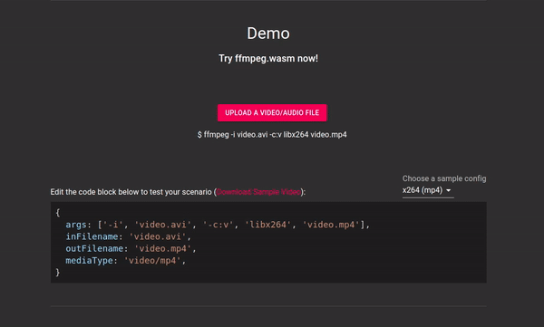

Official Website: https://ffmpegwasm.github.io/

FFmpeg is a famous framework/tool when it comes to video/audio processing, now with ffmpeg.wasm you can use FFmpeg right inside your browser without installation or upload your file to the server. Although ffmpeg.wasm is not as fast as FFmpeg, but it might come in handy for certain use cases.

In this post, I would like to share how to install and use ffmpeg.wasm and also technical details behind to support your usage.

# Install ffmpeg.wasm

To install and use ffmpeg.wasm, you only need to use npm/yarn:

```bash
$ npm install @ffmpeg/ffmpeg
# or
$ yarn add @ffmpeg/ffmpeg
```

To use ffmpeg.wasm in node environment, you also need to install `@ffmpeg/core` .
```bash
$ npm install @ffmpeg/core
# or
$ yarn add @ffmpeg/core
```
Or you can use a CDN

```bash
<script src='https://unpkg.com/@ffmpeg/ffmpeg@0.9.3/dist/ffmpeg.min.js'></script>
```

# Use ffmpeg.wasm

To use ffmpeg.wasm, only few lines of code are required:

```javascript
const fs = require('fs');
const { createFFmpeg, fetchFile } = require('@ffmpeg/ffmpeg');
const ffmpeg = createFFmpeg({ log: true });
(async () => {
  await ffmpeg.load();
  ffmpeg.FS('writeFile', 'test.avi', await fetchFile('./test.avi'));
  await ffmpeg.run('-i', 'test.avi', 'test.mp4');
  fs.writeFileSync('./test.mp4', ffmpeg.FS('readFile', 'test.mp4'));
  process.exit(0);
})();
```

> Don't forget to add `--experimental-wasm-threads` and `--experimental-wasm-bulk-memory` when executing the script in node.

Also you can try the live demo session in the official website: https://ffmpegwasm.github.io/#demo



# Behind the scene

To fully utilize/understand the power of ffmpeg.wasm (also for most WebAssembly libraries), few technical details you might want to know:

## Inside ffmpeg.load()

`ffmpeg.load()` is a required API to call before you call others. What happened inside this API is:

- Download ffmpeg-core.js from remote server (which is around 25MB)
- Instantiate ffmpeg.wasm wasm code
-
Depending on your network speed and host machine hardware, this operation can take up to minutes to complete.

## File System (FS)

When you check the API of ffmpeg.wasm, you may find an API called ffmpeg.FS() to handle File System operations. (In ffmpeg.wasm we use MEMFS / Memory File System) You can imagine this FS just like a hard disk where you can put the input file and pull the output file from ffmpeg.wasm command. It is essential as we want to keep minimal changes to FFmpeg source code and reserve its maxium similarity to original command line interface. Some command operations you might use:

1. `ffmpeg.FS('writeFile', 'filename', data)` : write file to MEMFS as input of ffmpeg.wasm
1. `ffmpeg.FS('readFile', 'filename')` : read file from MEMFS as output of ffmpeg.wasm
1. `ffmpeg.FS('unlink', 'filename')` : delete a file in MEMFS
1. `ffmpeg.FS('readdir', '/')` : list files inside specific path

For full list of APIs, you can check: https://emscripten.org/docs/api_reference/Filesystem-API.html

## SharedArrayBuffer

SharedArrayBuffer is a pretty new data type in JavaScript, right now most of the browsers still lack of fully support due to security issues. But in ffmpeg.wasm, to enable pthread / mutli-threading support to speed up, it is a required data type to use. 

- SharedArrayBuffer introduction: https://developer.mozilla.org/en-US/docs/Web/JavaScript/Reference/Global_Objects/SharedArrayBuffer
- Can I use SharedArrayBuffer?: https://caniuse.com/sharedarraybuffer

## Web Workers

When you run ffmpeg.run() , you might find tons of web workers spawned. It is a normal situation as web workers are simulating threads in FFmpeg and it is good as we don't want ffmpeg.wasm to block our main thread.

## Leverage CPU capabilities

For most of libraries work with ffmpeg (ex. x264), they use assembly language like x86 to speed up the process. But sadly, WebAssembly cannot directly use these x86 assembly code as it is not compatible or certain instructions are not supported. Thus it takes time to port x86 assembly to SIMD assembly to make it work.

---

It is still a long way to go as ffmpeg.wasm is still in an early stage (right now it is only v0.9), although it is still very slow comparing to original version, but with the growth and evolution of WebAssembly, I believe it will become more and more useful. 😃

Feel free to try and comments, issues or/and PRs are highly welcome!

Github: https://github.com/ffmpegwasm/ffmpeg.wasm
