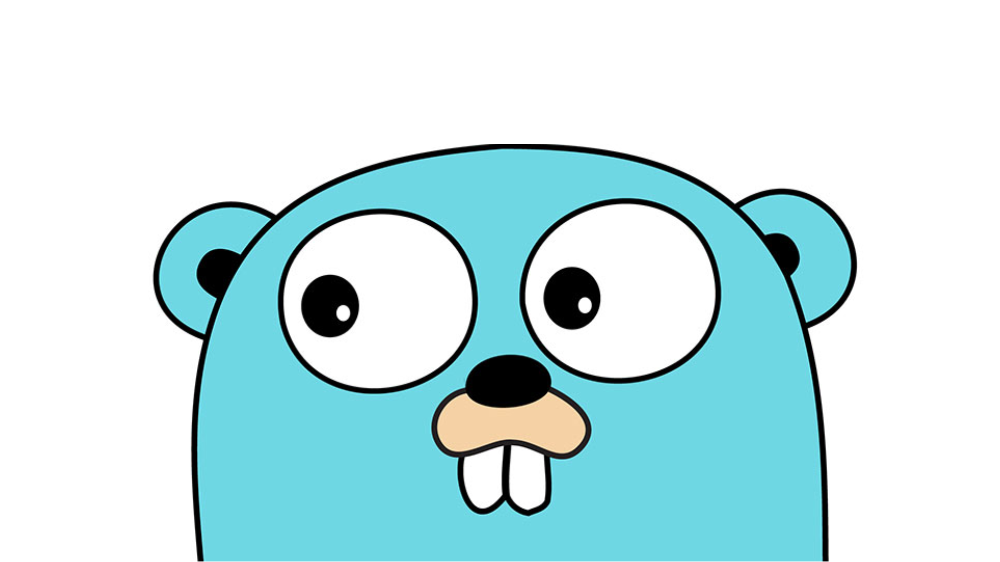

One thing I do dislike in golang is that sometimes a simple task can be very tedious. One of them is getting maximum / minimum value of two integers.

## Background

The root cause of the tediousness of this task is the lack of generics in golang which means you can not implement a max/min function which accepts both integer and float numbers. As the built-in max function is math package accepts float64, the common fixes that peope use are:

- Write a wrapper function for math.Max or math.Min to do type conversion

```go
func max(x, y int) int {
  return int(math.Max(float64(x), float64(y)))
}
```

- Write your own max function

```go
func max(x, y int) int {
    if x < y {
        return y
    }
    return x
}
```

You might think it is not too hard to implement any of the solutions above, but it is just a totally waste of time, especially when you are joining online contests or just practicing algorithms and data structure.

## Generics to the Rescue

So with the [new accepted proposal](https://go.googlesource.com/proposal/+/refs/heads/master/design/43651-type-parameters.md) in golang 1.18, finally we can fix this issue once and for all (if the built-in math.Max & math.Min is updated). A quick and dirty way can be done like below:

```go
type comparable interface {
  type int, int8, int16, int32, int64,
    uint, uint8, uint16, uint32, uint64, uintptr,
    float32, float64
}

func Max[T comparable](x, y T) T {
  return T(math.Max(float64(x), float64(y)))
}
```

> A working version [HERE](https://go2goplay.golang.org/p/_vWgGPiuyr_s)

If similar code like above can be added to the built-in math library, we don’t need to do it ourselves anymore. I believe there are a lot more applications like this can make golang a more elegant and less-tedious language in the future. Looking forward to the release of this version next year. 😃
