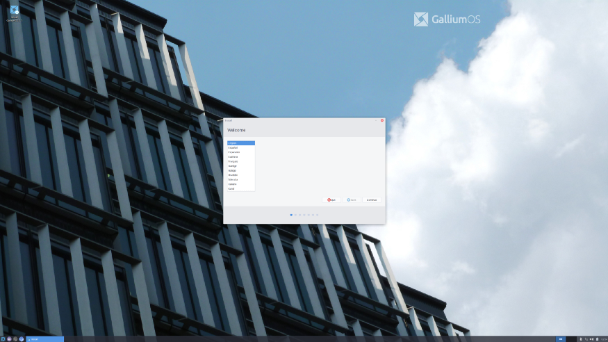

In 2019, I bought a Chromebook (HP Chromebook 13 G1, release on 2016) to be a lightweight laptop when I am out. I really enjoyed using Chrome OS with crouton, but one thing really bothers me is the fact I cannot run container. That’s why I decided to try the latest Gallium OS to get full Linux experience inside my Chromebook, but when I completed installing Gallium OS, the HiDPI hitted me and it took me tons of time to survey how to resolve this issue, but sadly I am only able to fix around 60% of them. To save time for people who may encounter the same issue, here is what did:

## Update xfce configration

There was a package called `galliumos-hidpi` to fix hidpi issue, I check the scripts and this script is the derived version of it:

```bash
#!/bin/sh

# Raise DPI from 96 to 276 to makes text size front
xfconf-query -c xsettings -p /Xft/DPI -s 276

# Enlarge cursor size
xfconf-query -c xsettings -p /Gtk/CursorThemeSize -s 48

# Raise xfce panel height
xfconf-query -c xfce4-panel -p /panels/panel-1/size -s 64

# Enlarge notification area icon
xfconf-query -c xfce4-panel -p /plugins/plugin-6/size-max -s 64

# Enlarge window size
xfconf-query -c xfce4-desktop -p /last/window-height -s 1240
xfconf-query -c xfce4-desktop -p /last/window-width -s 909

# Enlarge desktop icon
xfconf-query -n -t uint -c xfce4-desktop -p /desktop-icons/icon-size -s 96

# Use xhdpi theme, you can alsto use "Default-hdpi"
xfconf-query -c xfwm4 -p /general/theme -s "Default-xhdpi"

# Enlarge most of the icons
xfconf-query -c xsettings -p /Gtk/IconSizes -s gtk-menu=48,48:gtk-button=48,48:gtk-dialog=48,48:gtk-dnd=48,48:gtk-small-toolbar=48,48:gtk-large-toolbar=64,64
```

To execute this shell script(say `fix-hidpi.sh`), you need to:

```bash
$ sh fix-hidpi.sh
```

## GTK3 Scale

For small icons in menu, you can edit `/etc/profile.d/gdkscale.sh` and add following lines:

```bash
export GDK_SCALE=2.875
export GDK_DPI_SCAL=0.38 # 1/2.875
```

## xfce4-panel theming

For power manager plugin icon in xfce4-panel, create `~/.config/gtk-3.0/gtk.css` and add following lines:

```bash
#xfce4-power-manager-plugin * {
  -gtk-icon-transform: scale(0.38);
}
```

## Work in Progress
- Lightdm
- Xscreensaver
- Extended Monitor (hard one)

  Hope it helps someone to save some time.(like 2 days. Lol)
