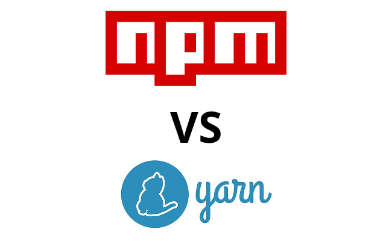
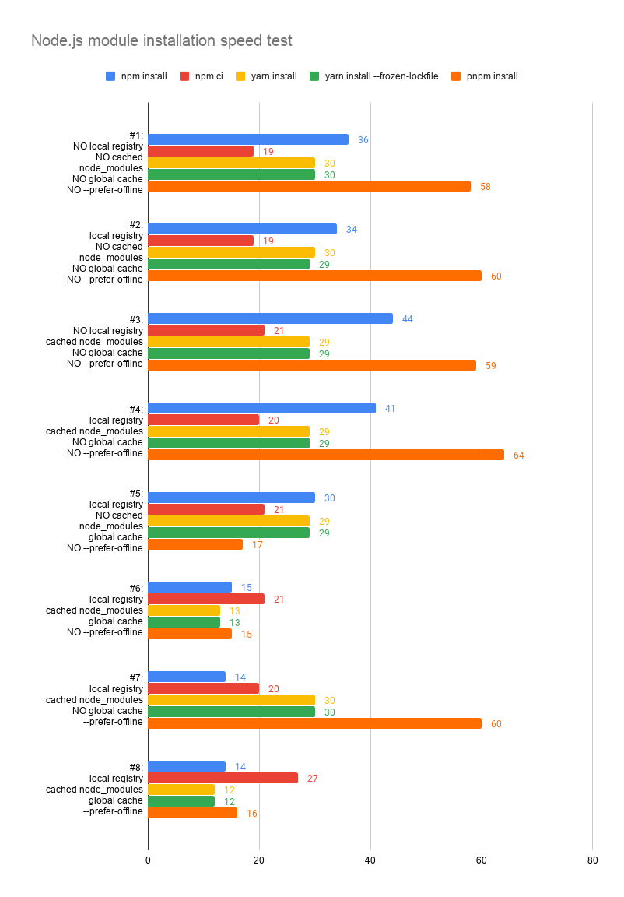

When you use Node.js in your project, you need to take care of node_modules installation in your CI/CD pipeline. You may use `npm install`, `npm ci`, `yarn install` and `pnpm install`, but what is the fastest way of doing so is still a question we are looking for answers. Here in this story I would like to experiment all possibilities I know to find out the final answer.

## TL;DR

If you are in a hurry, what you have to do are:

1. Disable stdout output
1. Use cached node_modules
1. Use `--prefer-offline`
1. Use global cache (`yarn` only)

```bash
$ tar zxvf node_modules.tar.gz
$ npm install --prefer-offline &> /dev/null
```

If you prefer yarn

```bash
$ tar zxvf node_modules.tar.gz
$ tar zxvf cache.tar.gz
$ yarn install --prefer-offline --cache-folder ./cache &> /dev/null
```

If you prefer pnpm

```bash
$ tar zxvf cache.tar.gz
$ pnpm config set store-dir $PWD/cache
$ pnpm install &> /dev/null
```

> The total speed up is around 3x comparing to pure `npm install`

## Existing Works

It is normal that someone already do it in the past, here are some existing works for your reference.

- https://github.com/appleboy/npm-vs-yarn
- https://winsmarts.com/npm-install-speed-up-by-3-times-almost-25ad416cf77e
- http://www.tiernok.com/posts/2019/faster-npm-installs-during-ci/

## Environment

### Packages

To prevent any cache or unexpected behavior, I run the experiment inside a docker container and every time we complete an installation, we run a new container for the next installation.

The docker image I use is `node:12` and the versions of each component are:

- node: v12.16.1
- npm: 6.13.4
- yarn: 1.22.0
- pnpm: 4.12.1

### Network

I experiment both remote and local registry (verdaccio) scenario to show the influence of network. In local registry, I assumed the user do something like:

```bash
$ npm install react@latest --registry http://nvy-registry:4873
# or
$ yarn add react@latest --registry http://nvy-registry:4873
```

Which makes the registry url in lock files points to the local registry directly.

### Application

To mimic a real world scenario, I did experiment in an web app that is created using `create-react-app`.

### Commands

There are 5 basic commands I use:

- npm install
- npm ci
- yarn install
- yarn install --frozen-lockfile
- pnpm install

> `yarn install --frozen-lockfile` is similar to `npm ci`

For all of them, I add `&> /dev/null` to remove stdout output and the execution time is averaged from 3 times of execution. (As the execution time is pretty stable, I believe 3 times is good enough)

Let’s start the experiment and see where we will achieve. 😃

## Parameters

There are 4 parameters we are going to tune:

1. local registry

With local registry, you can prevent stale when the network bandwidth is not enough. It is a good way to speed up but may be painful when someone clone your repository but unable to access the local registry you used. 2. cached node_modules

A common technique to speed up the installation, by zipping `node_modules` folder and unzipping before installation to eliminate the need of downloading modules again from network. 3. global cache

There is a global cache folder in `~/.npm` for npm and `~/.yarn` for yarn, by adding global cache in advance, I would like to know if it is possible to speed up. 4. `--prefer-offline`

Details: https://docs.npmjs.com/misc/config#prefer-offline

> If true, staleness checks for cached data will be bypassed, but missing data will be requested from the server. To force full offline mode, use `--offline`.

With this option, we can prevent npm or yarn to check remote data and use local cache directly.

## Experiment

Below are the result of all configurations:



> The number is the amount of seconds to complete modules installation

## Observations

- Always remember to disable the output of installation with `&> /dev/null` as stdout is pretty time-consuming
- Although local registry can guarantee the stability of downloading modules, it is not recommended to modify lock file to gain this benefit as the side effect is huge.
- The speed of `npm ci` is stable across different configurations, but `npm install` can be faster with `--prefer-offline`.
- The speed of `yarn install` and `yarn install --frozen-lockfile` are NOT different at all.
  Global cache is more useful for `yarn`
- The efficient of `pnpm` highly relies on the global cache, without cache, its speed is slower than others due to cache pre-processing overhead

---

For the source code of this experiment can be found in this repository: https://github.com/jeromewu/npm-vs-yarn-in-cicd

Hope you find it helpful and if you have any ideas to experiment to speed up even further, please feel free to leave a response or create an issue inside the repository. 😄
