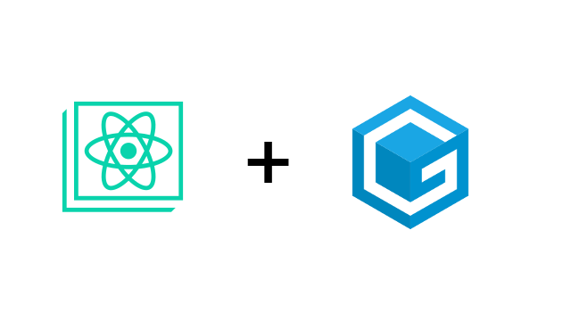
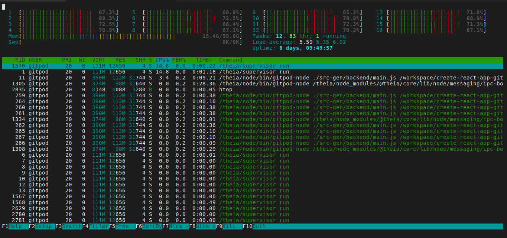
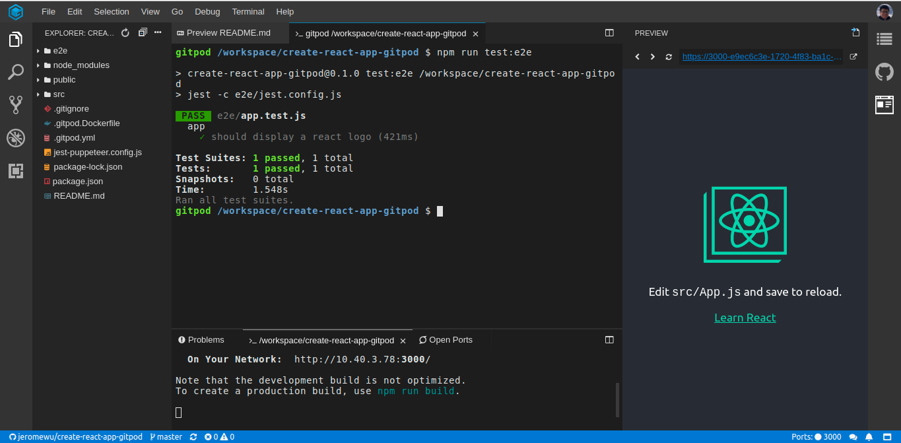

Japanese Version (translated by [Ryuichi Tanabe](https://medium.com/u/9724aaf6be6b?source=post_page-----dd4d0b33ce77--------------------------------)): https://qiita.com/baby-degu/items/bacf20f657625ae8747b

Gitpod is a great online IDE and here is how you can use in your create-react-app based project.

## Why Gitpod?

Sometimes we just don’t want to spend time to prepare the development environment and start coding as soon as possible. Gitpod is a Github-integrated and 100 hours per month free use online IDE, it provides flexibility to customize your work space with `.gitpod.yml`.



In this story, we will talk about how to leverage Gitpod when you have a project based on create-react-app (or any react project).

## Basic Configuration

In the basic configuration, we want to achieve following items:

1. `npm install` when we create the work space
1. `npm start` every time we start the work space
1. See preview every time we update the code

To achieve all the features, you just need to add a `.gitpod.yml` with following content:

```yaml
tasks:
  - init: npm install
    command: npm start

ports:
  - port: 3000
    onOpen: open-preview
```

It is pretty self-explained and you can use it most of the projects easily.

> More options in [official docs](https://www.gitpod.io/docs/44_config_start_tasks/)

## Advanced Configuration

An advanced scenario is to use puppeteer for end-to-end testing in your create-react-app, by default some dependencies used by puppeteer is not installed in Gitpod default work space image (gitpod/workspace-full). So we need to extend the Docker image to make it work.

Add `.gitpod.Dockerfile` in your repository:

```Dockerfile
FROM gitpod/workspace-full
RUN sudo apt-get update && sudo apt-get install -y libgtk-3-0 libx11-xcb1 libnss3 libxss1 libasound2
```

And update `.gitpod.yml` to use our `.gitpod.Dockerfile`

```yaml
image:
  file: .gitpod.Dockerfile

tasks:
  - init: npm install
    command: npm start

ports:
  - port: 3000
    onOpen: open-preview
```

Also you need to use `--no-sandbox` in jest-puppeteer, the full setup can be found here:

Repository: [https://github.com/jeromewu/create-react-app-gitpod](https://github.com/jeromewu/create-react-app-gitpod)

Gitpod: [https://gitpod.io/#https://github.com/jeromewu/create-react-app-gitpod](https://gitpod.io/#https://github.com/jeromewu/create-react-app-gitpod)

With full configuration, now you can have a working environment like below:



## One more thing

If you are a VIM user like me, here is a small trick (maybe not the best) to use your VIM configuration in Gitpod with least effort.

```yaml
image:
  file: .gitpod.Dockerfile

tasks:
  - init: wget https://github.com/jeromewu/docker-workspace/raw/master/vim.zip -O /tmp/vim.zip &> /dev/null && unzip /tmp/vim.zip -d /home/gitpod &> /dev/null
  - init: yarn install
    command: yarn start

ports:
  - port: 3000
    onOpen: open-preview
```

The concept here is to zip an existing VIM configuration, download and unzip to container, it saves lots of time to install but may not be a good option if you need to update your VIM configuration very often.

In a word, using Gitpod for your Github project offers you a powerful environment to develop your project anytime and anywhere with ease. Hope you find this story useful and happy coding. 😃
