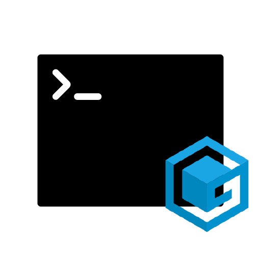
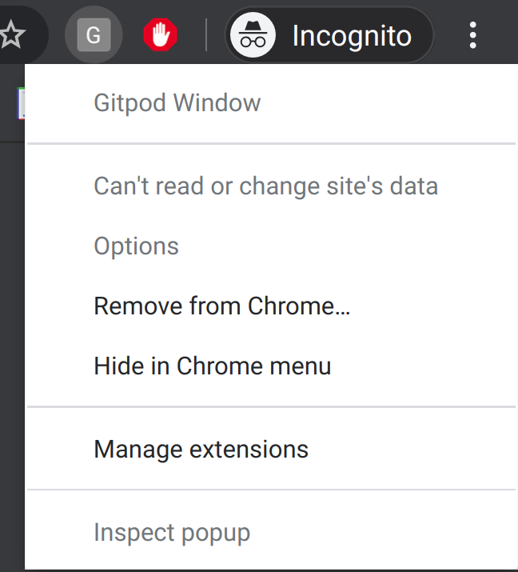
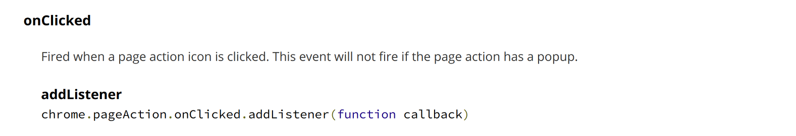
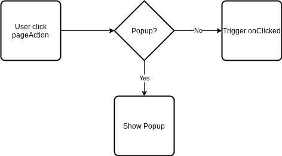
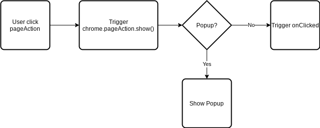

Gitpod is an online IDE for GitHub and GitLab, it is great and makes my life easier when there is not enough resource in my laptop. But as a VIM user it is pretty annoying when I hit Ctrl+w (which is commonly used to navigate between different VIM window), the whole Gitpod tab just close and I have to reopen it again.

That’s why I start to work on a Chrome Extension (Gitpod Window) to make the overall experience of using Gitpod even better. The requirements I listed are:

1. When user click the extension icon on a GitHub or GitLab page, opens Gitpod workspace in a popup Chrome window
1. Disable Chrome shortcuts

As I have almost no experience in building a Chrome Extension, I wrote this story to record the process and hope it can help newbies like me. 😃

## Get Started with Chrome Extension

Google provides a good official tutorial here: https://developer.chrome.com/extensions/getstarted

Quick summary for key components:

- manifest.json: Provides important information
- Background Script: Extensions monitor events in their background script, then react with specified instructions

Here we learnt that background script is where we can monitor events and it is a good starting point to achieve our goal.

> I would suggest those who want to follow the next step to complete the tutorial in the link above first.

## When user click the extension icon on a GitHub or GitLab page, opens Gitpod workspace in a popup Chrome window

As you can imagine, click on extension icon is an event, so we can do it in background script.

To handle the event, there are two types of actions you can choose: [pageAction](https://developer.chrome.com/extensions/pageAction) and [browserAction](https://developer.chrome.com/extensions/browserAction), as our extension only works on specific websites, we use `pageAction` here. A primary `manifest.json` below:

```json
{
  "manifest_version": 2,
  "name": "Gitpod Window",
  "version": "1.0.0",
  "description": "Gitpod Window disables browser shortcuts for you to prevent unwant behavior",
  "author": "Jerome Wu <jeromewus@gmail.com>",
  "permissions": [
    "*://github.com/*/*",
    "*://gitlab.com/*/*"
  ],
  "background": {
    "scripts": ["background.js"],
    "persistent": false
  },
  "page_action": {}
}
```

In `permissions`, we add GitHub and GitLab URLs to restrict that this extension only works on the repository page. (ex. https://github.com/jeromewu/gitpod-window) We also add a key page_action to identify that we are going to use `pageAction` APIs in this extension.

With `manifest.json` settled, next we need to update `background.js` to popup the window with [windows](https://developer.chrome.com/extensions/windows) API:

```javascript
/*
 * Window popup using page action
 *
 * @ref: https://developer.chrome.com/extensions/pageAction
 *
 */

chrome.pageAction.onClicked.addListener(({ url }) => {
  chrome.windows.create({
    url: `https://.gitpod.io/#${url}`,
    type: 'popup',
  });
});
```

Ideally, we should be able to see a new popup window created when we click on the extension icon, but if you try to code above, you will see a context menu instead.



The behavior is not the same as we expected and if you take a close look to the chrome.pageAction.onClicked.addListener(), you will see an interesting statement:



**This event will not fire if the page action has a popup.**

As we don’t do anything about popup, it means the popup doesn’t exist, right? The answer is yes, but there is a strange behavior for onClicked, usually it should look like this:



But actually, the decision is made after chrome.pageAction.show()



So if you don’t trigger chrome.pageAction.show() first, it won’t trigger onClicked, I found this answer when checking samples from [HERE](https://developer.chrome.com/extensions/examples/api/pageAction/set_icon.zip) and it is really a trap when using onClicked.

To solve this issue, we need to trigger chrome.pageAction.show() on the tab we click extension icon manually. We need to use onUpdated and onActivated in [tabs](https://developer.chrome.com/extensions/tabs) API. Before we start using tabs, don’t forget to update `permissions` in the `manifest.json` first:

```json
{
  "manifest_version": 2,
  "name": "Gitpod Window",
  "version": "1.0.0",
  "description": "Gitpod Window disables browser shortcuts for you to prevent unwant behavior",
  "author": "Jerome Wu <jeromewus@gmail.com>",
  "permissions": [
    "tabs",
    "*://github.com/*/*",
    "*://gitlab.com/*/*"
  ],
  "background": {
    "scripts": ["background.js"],
    "persistent": false
  },
  "page_action": {}
}
```

Then let’s update `background.js`:

```javascript
/*
 * Window popup using page action
 *
 * @ref: https://developer.chrome.com/extensions/pageAction
 * @ref: https://developer.chrome.com/extensions/examples/api/pageAction/set_icon.zip
 * This is a workaround to make sure chrome.pageAction.onClicked works.
 *
 * The idea here to to force popup to show on GitHub and GitLab pages,
 * but as we don't assign popup, it fails and called onClicked.
 * If we don't do this, onClicked won't be triggered.
 */

const forcePopup = ({ id, url }) => {
  if (/https?:\/\/(github|gitlab).com\/*\/*/.test(url)) {
    chrome.pageAction.show(id);
  }
};

chrome.tabs.onUpdated.addListener((tabId, activeInfo, tab) => {
  forcePopup(tab);
});

chrome.tabs.onActivated.addListener(({ tabId }) => {
  chrome.tabs.get(tabId, forcePopup);
});

chrome.pageAction.onClicked.addListener(({ url }) => {
  chrome.windows.create({
    url: `https://.gitpod.io/#${url}`,
    type: 'popup',
  });
});
```

The idea here is to call chrome.pageAction.show() on the GitHub and GitLab pages to trigger onClicked.

Now we have completed our first requirement! It is a nice-looking popup window that makes Gitpod more close to an IDE, but there is no IDE can be closed with Ctrl+W, let move on to the next part to disable shortcuts.


## Disable keyboard shortcuts

To disable shortcuts, I planned to use [commands](https://developer.chrome.com/extensions/commands) API, but in the end I found that you don’t need to do anything as the shortcuts that annoying us are disabled by default. (incl. Ctrl+W, Ctrl+N, Ctrl+T) So we complete this issue by using popup window here!

Hope you enjoy this story and if you would like to know more about this Chrome Extension, you can visit:
- GitHub Repository: https://github.com/jeromewu/gitpod-window/tree/v1.0.1
- Chrome Web Store: https://chrome.google.com/webstore/detail/gitpod-window/jhpkbhdoenpnfnnkelgpikndadikogdl
