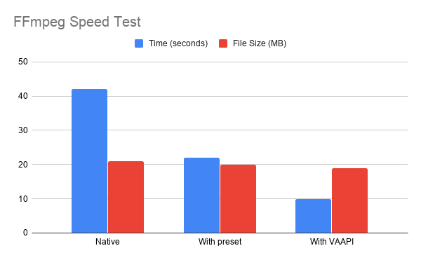

FFmpeg is a great tool when it comes to multimedia manipulation, by default it uses CPU with multi-thread to do the task which causes a high loading to your PC and is kind of slow most of the time.

If you google how to improve the speed of FFmpeg, you may find discussions about using `-preset` which lowers the compression ratio for higher speed (a trade-off between file size and speed) and another sexy approach is to leverage nVidia GPU (nvenc, nvdec and cuvid), but it it is not easy as:

1. You don’t own a compatible nVidia GPU card
1. You need to install nVidia GPU drivers and CUDA (painful in Linux environment)
1. You need to compile FFmpeg from source if you cannot find a ready-to-use version

In my own experience, I spent hours to research how to install and compile FFmpeg, but fails in the end as my GPU is unable to support most of the features, that was sad.

So is there any other way to make FFmpeg faster? Yes, and you can do that within seconds using VAAPI. Let’s do an experiment to see the differences.

## Baseline: Scale a video without any options

Imagine you are creating a service to provide video streaming with different quality (720p, 1080p, etc.), so you need to scale down the uploaded video to different resolution.

Let’s download a sample video from h264info and scale down without any options:

```bash
$ ffmpeg -i gravity.mp4 \
    -c:v libx264 \
    -s 1024x428 \
    -b:v 1M \
    out.mp4
```

It takes about 42 seconds (speed=3.5x) with 21 MB file size. (the original size is 355 MB)

## With -preset to speedup with larger file size

> Check [HERE](https://trac.ffmpeg.org/wiki/Encode/H.264) for more details about preset

Use preset, you can easily speed up FFmpeg with larger file size, which is acceptable when you have enough space left in your hard disk.

```bash
$ ffmpeg -i gravity.mp4 \
    -c:v libx264 \
    -preset ultrafast \
    -s 1024x428 \
    -b:v 1M \
    out.mp4
```

It takes about 22 seconds (speed=6x) and with 20 MB file size. (Interesting, it is smaller than `-preset default` 😎)

## With VAAPI to speedup with integrated/ Intel GPU card

Video Acceleration API (VAAPI) is not a secret in FFmpeg, but it is hard to notice how it can easily help you to speedup FFmpeg. The benefits of using VAAPI are:

1. The integrated GPU card is cheap (and you already have one now)
1. You only have to install i965-va-driver to make it work
1. You don’t have to compile FFmpeg as this flag is enabled by default

To use VAAPI in Ubuntu, first you need to install driver and check status with vainfo command:

```bash
$ sudo apt-get install i965-va-driver
$ vainfo
libva info: VA-API version 1.1.0
libva info: va_getDriverName() returns 0
libva info: Trying to open /usr/lib/x86_64-linux-gnu/dri/i965_drv_video.so
libva info: Found init function __vaDriverInit_1_1
libva info: va_openDriver() returns 0
vainfo: VA-API version: 1.1 (libva 2.1.0)
vainfo: Driver version: Intel i965 driver for Intel(R) Ivybridge Mobile - 2.1.0
vainfo: Supported profile and entrypoints
      VAProfileMPEG2Simple            : VAEntrypointVLD
      VAProfileMPEG2Simple            : VAEntrypointEncSlice
      VAProfileMPEG2Main              : VAEntrypointVLD
      VAProfileMPEG2Main              : VAEntrypointEncSlice
      VAProfileH264ConstrainedBaseline: VAEntrypointVLD
      VAProfileH264ConstrainedBaseline: VAEntrypointEncSlice
      VAProfileH264Main               : VAEntrypointVLD
      VAProfileH264Main               : VAEntrypointEncSlice
      VAProfileH264High               : VAEntrypointVLD
      VAProfileH264High               : VAEntrypointEncSlice
      VAProfileH264StereoHigh         : VAEntrypointVLD
      VAProfileVC1Simple              : VAEntrypointVLD
      VAProfileVC1Main                : VAEntrypointVLD
      VAProfileVC1Advanced            : VAEntrypointVLD
      VAProfileNone                   : VAEntrypointVideoProc
      VAProfileJPEGBaseline           : VAEntrypointVLD
```

If you see similar output like above, that means your Intel GPU card supports VAAPI, then you can use following command to scale:

```bash
$ ffmpeg -hwaccel vaapi \
    -hwaccel_device /dev/dri/renderD129 \
    -hwaccel_output_format vaapi \
    -i gravity.mp4 \
    -vf "scale_vaapi=w=1024:h=428" \
    -c:v h264_vaapi \
    -b:v 1M \
    out.mp4
```

It takes about 10 seconds (speed=14.3x) and with 19 MB file size.

---

Put them altogether in a chart, using VAAPI can get the almost 4x speedup comparing to native and a little smaller file size as well.



In fact, if you invest time and effort to survey the nVidia GPU option you can have even more speedup, but it is still great to have speedups without too much effort and cost, isn’t it? 😄

Hope you find this post useful and don’t hesitate to leave any responses or claps, thank you!
