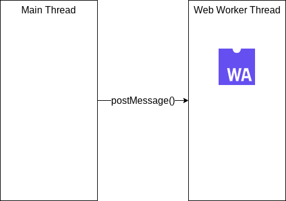

Most of the time, we run WebAssembly code inside a Web Worker (or worker_thread in Node.js) to prevent blocking the main thread and maintaining a responsive UI.

To communicate with Web Worker, we use [Window.postMessage()](https://developer.mozilla.org/en-US/docs/Web/API/Window/postMessage) to send data from main thread to web worker thread. Sometimes you may need to send megabytes of data (especially for multimedia applications) and it will result in long data transmission time and even out of memory exception due to the nature of postMessage() is to clone the data from main thread to web worker thread.



To solve this issue, you can use [Transferable](https://developer.mozilla.org/en-US/docs/Web/API/Transferable) in postMessage(), simply pass second argument in postMessage() and you can get a speed up and memory saving without too much trouble.

```javascript
// Without Transerable, takes up to 2000 ms for worker to get data
const data = new UInt8Array(1024*1024*1024);
worker.postMessage(data);

// With Transerable, takes up to 100 ms for worker to get data
const data = new UInt8Array(1024*1024*1024);
worker.postMessage(data, [data.buffer]);
```

Check a demo in this repository: https://github.com/jeromewu/web-worker-transferable-demo

As it is almost free to use Transferable and get speed up and memory saving in your application, you should start to use it in your application right now.

See you in next story. :)
