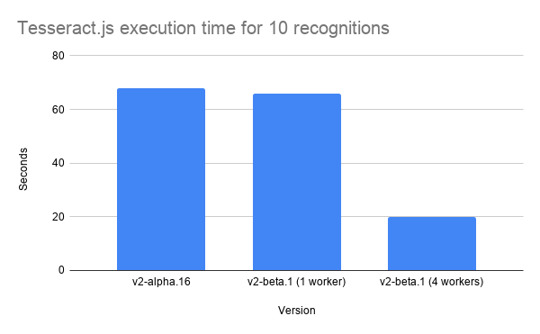

After almost 2 years of maintaining tesseract.js, I have to say tesseract.js hit its limitation as some of the issues from users are hard to fix, especially those related to performance.

The existing tesseract.js (before v2.0.0-alpha) offers declarative and coarse-grained APIs that minimize the effort to understand the complex design of the library, it hides details like how tesseract.js loads *.traineddata from remote, how the *.traineddata is saved to local file system or IndexDB as cache, how the WebAssembly version of tesseract-ocr is initialed with parameters, set the image and generated the result we desired. It is great and everyone is happy to get a turn-key OCR library to integrate into your project.

```javascript
// Typical usage of tesseract.js
const { TesseractWorker } = Tesseract;
const worker = new TesseractWorker();
const image = 'https://tesseract.projectnaptha.com/img/eng_bw.png';
worker.recognize(image)
  .then(({ text }) => {
    console.log(text);
  });
```

But as you use tesseract.js more and more in your project, you figure out the performance is not so good. It feels like every time you call recognize(), tesseract.js always starts from scratch and loads the *.traineddata, initializes its core and set the parameters again and again. It really takes lots of time and the performance becomes unsatisfied.

Another issue is that every time you want to do something that tesseract-ocr can do with tesseract.js, it fails immediately and you totally don’t know how to solve it, so you create an issue and cross your finger hope someone can save you, but most of the time, the miracle doesn’t happen. So you dive into the source code and find out it is really complicated and twisted inside, in the end you may give up or email the active maintainers of the tesseract.js and wait for the reply.

---

So I decided to refactor tesseract.js and after few weeks it is almost done (released as v2.0.0-beta.1) and I would like to share with you the major changes:

1. tesseract.js-core (WebAssembly version of tesseract-ocr) is now upgraded using tesseract-ocr v4.1 and emscripten 1.38.45 fastcomp (upstream is not stable enough to compile tesseract-ocr)
1. Refactor APIs to be more readable, imperative and fine-grained (we will cover this part later)
1. Support scheduling to execute multiple OCR tasks at the same time
1. Support typescript with index.d.ts
1. Rewrite documents (especially docs/api.md)
And below is how it looks right now:

```javascript
// tesseract.js@^2.0.0-beta.1
const { createWorker } = require('tesseract.js');
const image = 'https://tesseract.projectnaptha.com/img/eng_bw.png';
const worker = createWorker();
(async ()=> {
  await worker.load();
  await worker.loadLanguage('eng');
  await worker.initialize('eng');
  const { data: { text } } = await worker.recognize(image);
  console.log(text);
})();
```

It may feel kind of weird to see that you need to do more things in the new version, but with more lines of code you have more in-depth control of tesseract.js and boost the performance of your project. A possible use case is like this:

```javascript
const { createWorker } = require('tesseract.js');
const image = 'https://tesseract.projectnaptha.com/img/eng_bw.png';
const worker = createWorker();
let isReady = false;
// Called as early as possible
(async ()=> {
  await worker.load();
  await worker.loadLanguage('eng');
  await worker.initialize('eng');
  isReady = true;
})();
// Do other stuffs
(async (img) => {
  if (isReady) {
    const { data: { text } } = await worker.recognize(img);
    console.log(text);
  }
})(image);
```

The benefit is that you can prepare the worker as early as possible to improve the overall user experience.

Another important feature is that we add scheduling capabilities for you to use multiple workers at the same time. It is useful when you have enough resource (CPU cores) for your project to decrease the time for massive recognition jobs.

Below is a sample code for using scheduler with 4 workers to handle 10 recognition jobs:

```javascript
const { createWorker, createScheduler } = require('tesseract.js');
const image = 'https://tesseract.projectnaptha.com/img/eng_bw.png';

const scheduler = createScheduler();

(async () => {
  for (let i = 0; i < 4; i++) {
    const w = createWorker();
    await w.load();
    await w.loadLanguage('eng');
    await w.initialize('eng');
    scheduler.addWorker(w);
  }
  const rets = await Promise.all(Array(10).fill(0).map(() => (
    scheduler.addJob('recognize', image);
  )));
  console.log(rets.map(({ data: { text } }) => text));
  await scheduler.terminate();
})();
```

The role of scheduler is to manage the job queue and worker pool and distribute jobs any idle workers.

A performance comparison between alpha version and beta version can be found below (using Node version in a 8 core machine).



Source code: https://github.com/jeromewu/tesseract.js-performance
With 4 workers we can have a almost 3x speed up (from 60s to 20s), it is possible to speed up with even more workers!

If you are interested in using tesseract and giving feedback, please visit tesseract.js github and try it with following command:
```
$ npm install tesseract.js@next
```
Hope you enjoy tesseract.js and thanks for reading this story. :)
